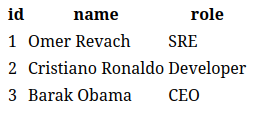

# Employee List

## This is a simple web application for displaying employee information. The application uses Flask for the backend and MySQL as the database, with a Dockerized setup for easy deployment.



```
docker-compose-mysql-webapp/
├── app
│   ├── app.py
│   ├── Dockerfile
│   ├── requirements.txt
│   └── templates
│       └── index.html
├── docker-compose.yml
├── init-db
│   └── init.sql
└── README.md
```

### Application Features
- **Employee Display:** The application retrieves employee information from a MySQL database and displays it in a user-friendly table format.
- **Dynamic Data:** The employee list is dynamically fetched from the database, allowing for real-time updates as data changes.


### Bonus Features
- The Flask app gracefully handles database connection errorsusing exceptions and passing the error to the index.html for the user to see
- The services follow best practices, such as using environment variables for configuration(.env).

#### `Prerequisites`
- Docker
- Docker Compose

###  Setup Instructions
1. **Clone this repository:**
    ```
    git clone <repository_url>
    cd <repository_directory>
    ```

2. **Create a .env file in the root directory:**
    ```
    MYSQL_DATABASE=panaya
    MYSQL_ROOT_PASSWORD=secret
    MYSQL_USER=omer
    MYSQL_PASSWORD=omer
    ```

3. **Start the application:**
    ```
    docker-compose up --build -d
    ```

4. **Open your browser and navigate to:**
    ```
    http://127.0.0.1:5000
    ```

5. **To stop the application:**
    ```
    docker-compose down
    ```
